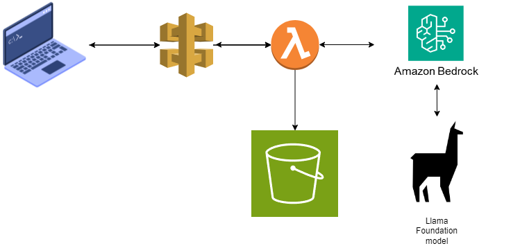

# AWS-BedrockBlogGeneration
Blog Generation using AWS Bedrock with Lambda and APIGateway Invocation

# AWS Bedrock Blog Generator

This project leverages Amazon Bedrock to generate blog content based on a given topic and saves the output to an S3 bucket. The solution is implemented as an AWS Lambda function.

## Features

- Generates a blog post using the Amazon Bedrock model.
- Saves the generated content to an AWS S3 bucket.
- Can be deployed as an AWS Lambda function.

## Architecture Diagram



## File Overview

- `app.py`: Main script that handles blog generation and saving to S3.

## Prerequisites

- AWS account with access to Bedrock and S3 services.
- Python 3.8 or higher.
- `boto3` and `botocore` Python libraries.

## Installation

1. **Clone the Repository**:
   ```bash
   git clone https://github.com/yourusername/aws-bedrock-blog-generator.git
   cd aws-bedrock-blog-generator
